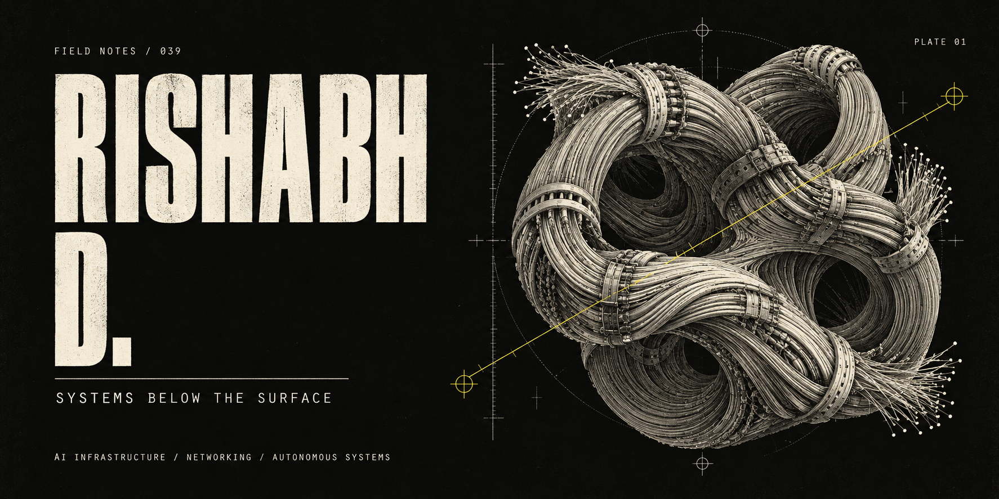

<p align="center">
  
</p>

<p align="center">
  <sub>FIELD RECORD 039 &nbsp; / &nbsp; AI INFRASTRUCTURE · NETWORKING · AUTONOMOUS SYSTEMS</sub>
</p>

# I build the layer beneath the model.

I'm **Rishabh D**. I work across AI infrastructure, distributed networking, autonomous agents, and low-level runtimes. My attention goes to the parts you usually don't see: **GPU fabrics, inference, orchestration, observability, and the machinery that makes execution possible**.

<p>
  <a href="https://rishabhdurugkar.me/"><b>Enter portfolio ↗</b></a>
  &nbsp;&nbsp; / &nbsp;&nbsp;
  <a href="https://github.com/rootuser39">GitHub ↗</a>
  &nbsp;&nbsp; / &nbsp;&nbsp;
  <a href="#01--specimen-index">Inspect the systems ↓</a>
</p>

---

## 01 / Specimen index

Ongoing systems. Different scales. A shared interest in what happens after intent becomes execution.

| System | Inside the specimen |
| :--- | :--- |
| **Ⅰ · CORTEX** | A broader autonomous intelligence architecture connecting **agents, inference, runtimes, and compute infrastructure**. |
| **Ⅱ · [ARGUS](https://github.com/rootuser39/ARGUS-Autonomous-Runtime-for-Governed-User-Sovereignty)** | Autonomous Runtime for Governed User Sovereignty. **Intent reconstruction, planning, model routing, memory, and governed execution.** |
| **Ⅲ · [AI Fabric Lab](https://github.com/rootuser39/ai-fabric-lab-)** | Experiments in the physical conversation between accelerators. **GPU networking, RoCEv2, InfiniBand, congestion, and telemetry.** |
| **Ⅳ · [AegisNet](https://github.com/rootuser39/AegisNet-AI-Network-Failure-Simulator-Auto-Diagnoser)** | AI-assisted network failure simulation and diagnosis. **Networking, automation, and troubleshooting.** |

<br />

## 02 / Below the surface

```text
              INTENT
                 │
       reconstruct · plan
                 │
              RUNTIME
                 │
        route · orchestrate
                 │
              FABRIC
                 │
         connect · execute
                 │
              MACHINE
                 │
         observe · verify
                 │
        remember ↺ repeat
```

**Currently digging into:** distributed AI systems, GPU networking, Linux internals, cybersecurity, and systems programming.

> Build the runtime. Understand the system. Measure what actually happens.

<br />

## 03 / Instrument drawer

<details>
<summary><b>Open the drawer</b> &nbsp; <sub>languages / compute / infrastructure / data</sub></summary>

<br />

| Layer | Tools |
| :--- | :--- |
| **Languages & systems** | Python · C++ · Linux · Git |
| **AI & compute** | PyTorch · TensorFlow · NVIDIA / CUDA · Jupyter |
| **Infrastructure** | Docker · Kubernetes · Terraform · AWS · Azure · GitHub Actions |
| **Data & networking** | PostgreSQL · MySQL · NumPy · pandas · Cisco networking |

</details>

<br />

## 04 / Open channel

Interested in technically serious work around **distributed inference, AI-fabric networking, agent runtimes, low-level execution, cybersecurity, and open-source systems research**.

If the problem lives somewhere between a model, a network, and a machine, I'd like to hear about it.

**[Find me through my portfolio ↗](https://rishabhdurugkar.me/)** &nbsp; / &nbsp; **[Explore the repositories ↗](https://github.com/rootuser39?tab=repositories)**

---

<p align="center">
  <sub>END OF FIELD RECORD &nbsp; / &nbsp; 039 &nbsp; / &nbsp; THE MACHINE CONTINUES BELOW.</sub>
</p>
