  <picture>
    <source media="(max-width: 640px)" srcset="./assets/observatory-mobile.svg" />
    
  </picture>

  <a href="#systems-in-orbit">Systems</a> &nbsp; / &nbsp;
  <a href="#operating-principles">Principles</a> &nbsp; / &nbsp;
  <a href="#instrument-drawer">Tools</a> &nbsp; / &nbsp;
  <a href="#open-channel">Open channel</a>

 

# I build the layer beneath the model.

I'm **Rishabh D**. I work across **AI infrastructure, networking, autonomous agents, and low-level runtimes**. My attention goes to the machinery that makes execution possible: GPU fabrics, inference, orchestration, and observability.

**Architect** the system. **Study** the mechanism. **Make** something worth looking at.

 

01 / THE WORK

## Systems in orbit

Experimental systems at different stages. Open a panel to inspect the work.

  
  
  
  

<b>Read the technical briefs</b> &nbsp; what each system investigates

 

| System | Investigation | Enter here |
| :--- | :--- | :--- |
| **CORTEX Ω** | A vertically integrated experimental architecture connecting identity, agents, inference, adaptive services, and compute. | [Architecture & phases](https://github.com/rootuser39/CorteX#master-architecture) |
| **ARGUS** | Intent reconstruction, planning, model routing, memory, and governed execution. | [Runtime repository](https://github.com/rootuser39/ARGUS-Autonomous-Runtime-for-Governed-User-Sovereignty) |
| **AI Fabric Lab** | Synthetic incast experiments, NCCL log parsing, and congestion models. RoCEv2, InfiniBand, and GPU networking are the wider research scope. | [Run the experiments](https://github.com/rootuser39/ai-fabric-lab-/blob/main/docs/START_HERE.md) |
| **AegisNet** | Early scaffold for network failure simulation and AI-assisted diagnosis. | [Inspect the scaffold](https://github.com/rootuser39/AegisNet-AI-Network-Failure-Simulator-Auto-Diagnoser) |

 

02 / HOW I WORK

## Operating principles

| Lens | The question |
| :--- | :--- |
| **Architecture** | What has to exist beneath this for it to work? |
| **Experiment** | What can I build to test the assumption? |
| **Failure** | Where does it break, and what evidence explains why? |
| **Craft** | Can the complexity become legible? |

**Currently exploring:** distributed AI systems · GPU networking · Linux internals · cybersecurity · systems programming.

  

03 / THE BENCH

## Instrument drawer

<b>Open the drawer</b> &nbsp; languages / compute / infrastructure / data

 

| Layer | Tools |
| :--- | :--- |
| **Languages & systems** | Python · C++ · Linux · Git |
| **AI & compute** | PyTorch · TensorFlow · NVIDIA / CUDA · Jupyter |
| **Infrastructure** | Docker · Kubernetes · Terraform · AWS · Azure · GitHub Actions |
| **Data & networking** | PostgreSQL · MySQL · NumPy · pandas · Cisco networking |

 

04 / INTERSECTIONS

## Open channel

Interested in technically serious collaboration around **distributed inference, AI fabrics, agent runtimes, low-level execution, cybersecurity, and open-source systems research**.

If the problem lives somewhere between a model, a network, and a machine, I'd like to hear about it.

**[Explore the repositories ↗](https://github.com/rootuser39?tab=repositories)**

 

---

  FIELD RECORD 039 &nbsp; / &nbsp; THE MACHINE CONTINUES BELOW.

<!-- Artwork is self-contained, script-free SVG. Rebuild: python3 scripts/build_observatory.py -->
