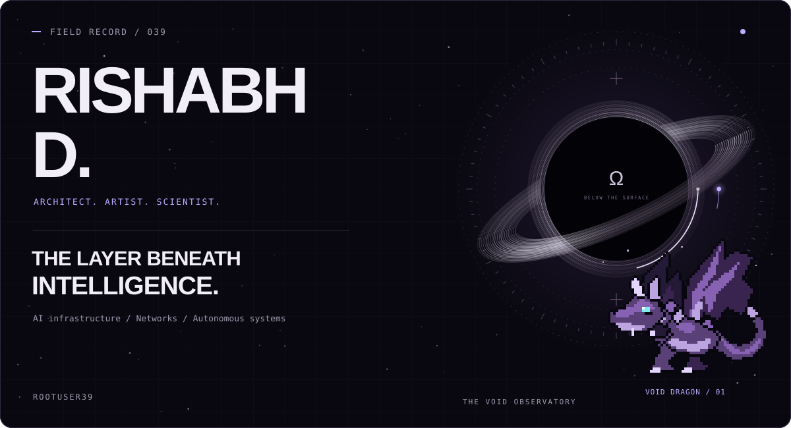
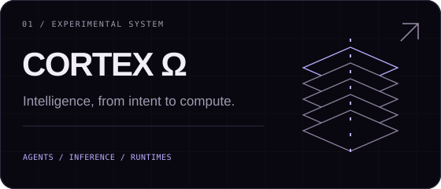
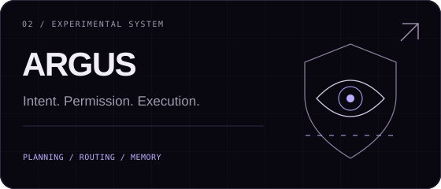
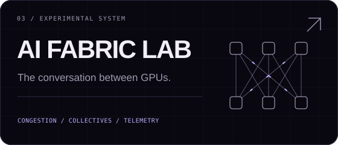
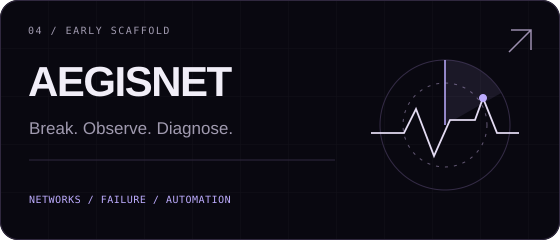
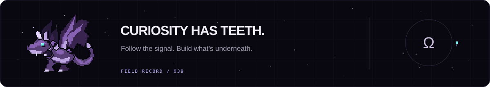

<p align="center">
<picture>
<source media="(prefers-reduced-motion: reduce) and (max-width: 640px)" srcset="./assets/still/observatory-mobile.svg" />
<source media="(prefers-reduced-motion: reduce)" srcset="./assets/still/observatory.svg" />
<source media="(max-width: 640px)" srcset="./assets/observatory-mobile.svg" />
</picture>
</p>

<p align="center"><a href="#current-signal">Signal</a> &nbsp; / &nbsp; <a href="#systems-in-orbit">Systems</a> &nbsp; / &nbsp; <a href="#evidence">Evidence</a> &nbsp; / &nbsp; <a href="#questions-i-am-chasing">Questions</a> &nbsp; / &nbsp; <a href="#instrument-drawer">Bench</a> &nbsp; / &nbsp; <a href="#open-channel">Channel</a></p>

# I build the layer beneath the model.

I'm **Rishabh D.** I investigate what happens between a model request and the hardware that executes it. My work connects AI infrastructure, networking, autonomous agents and the runtimes beneath them.

**Architect** the system. **Study** the mechanism. **Make** something worth looking at.

[Open the interactive laboratory locally](docs/CONTENT.md#run-the-interface) · [Interface source](index.html)

<sub>01 / WORKING RECORD</sub>

## Current signal

**UPDATED / 2026-10-02 · WORKING RECORD**

Manually maintained content snapshot. This is the content edit date, not live telemetry.

**BUILDING**<br>
Inspectable systems and experiment records.

**INVESTIGATING**<br>
Runtime traces / collective timing / finite queues.

**BREAKING**<br>
No fault-injection run documented.

**LEARNING**<br>
Intent → runtime → fabric → hardware.

**LATEST EXPERIMENT**<br>
[E-004 / Phasing cannot create capacity](#experiment--e-004) · recorded 2026-09-11 · **synthetic**

**LAST SHIPPED**<br>
[Pixel-art Void Dragon and responsive observatory artwork](https://github.com/rootuser39/RIshabh/commit/01816b84cde088f93c2d1f2da9cbf04e1f44909d) · 2026-10-02

**CONTENT TELEMETRY**<br>
4 systems · 4 experiments · 2 field logs · 1 failure record · 2 transmissions<br>
Derived from these content files. Source review / 2026-10-02.

<sub>02 / THE WORK</sub>

## Systems in orbit

Inspect the question, the built pieces and the boundary. The records distinguish architecture, prototypes and scaffolding.

<p align="center">
<a href="#system--cortex"><picture>
<source media="(prefers-reduced-motion: reduce)" srcset="./assets/still/cortex.svg" />
</picture></a>
<a href="#system--argus"><picture>
<source media="(prefers-reduced-motion: reduce)" srcset="./assets/still/argus.svg" />
</picture></a>
<a href="#system--fabric"><picture>
<source media="(prefers-reduced-motion: reduce)" srcset="./assets/still/fabric.svg" />
</picture></a>
<a href="#system--aegis"><picture>
<source media="(prefers-reduced-motion: reduce)" srcset="./assets/still/aegisnet.svg" />
</picture></a>
</p>

<details>
<summary><b>Inspect CORTEX Ω</b> · ARCHITECTURAL SCOPE</summary>

### SYSTEM / cortex

**CORTEX Ω — An architectural umbrella from intent to compute.**

**QUESTION**<br>
How can identity, agents, inference and compute form a coherent architecture?

**WHY IT EXISTS**<br>
A model interface alone leaves the execution machinery and its relationships unexplained.

**CURRENT STATE**<br>
ARCHITECTURAL SCOPE

**CURRENTLY INVESTIGATING**<br>
Public implementation evidence is not included here. The linked source repository is access-restricted.

**NEXT EXPERIMENT**<br>
Not yet documented in the public portfolio.

**ARCHITECTURE**<br>
Identity / intent → Agent runtime → Inference → Adaptive services → Compute

**BUILT**

Not yet documented in the public portfolio.

**EVIDENCE**

- [Existing public architecture summary](https://github.com/rootuser39/RIshabh/blob/01816b84cde088f93c2d1f2da9cbf04e1f44909d/README.md)
- [Architecture repository · access may be required](https://github.com/rootuser39/CorteX)

**BOUNDARY**<br>
Architecture scope, not a claim that the layers are integrated or operational.

</details>

<details>
<summary><b>Inspect ARGUS</b> · PROTOTYPE</summary>

### SYSTEM / argus

**ARGUS — Make a request’s execution path explicit and inspectable.**

**QUESTION**<br>
Can intent, planning, routing and memory remain visible through an inference run?

**WHY IT EXISTS**<br>
Hidden execution and disposable chat state make it difficult to inspect what a runtime did.

**CURRENT STATE**<br>
PROTOTYPE

**CURRENTLY INVESTIGATING**<br>
Semantic verification, capability/approval policy and sandboxed tool execution remain planned modules.

**NEXT EXPERIMENT**<br>
Planned: test how verification gates memory when provider output is empty or misleading.

**ARCHITECTURE**<br>
Request → Intent → Plan → Model route → Inference provider → Output check → JSONL memory

**BUILT**

- Structured intent and plans
- Model-tier routing
- Deterministic stub and Nebius provider adapters
- Provider, model, latency and token fields in the execution trace
- JSONL memory writes after the output check

**EVIDENCE**

- [Execution spine](https://github.com/rootuser39/ARGUS-Autonomous-Runtime-for-Governed-User-Sovereignty/blob/8b8997ee747e7294947ae5779ede8099c193849f/argus/core/orchestrator.py)
- [Trace model](https://github.com/rootuser39/ARGUS-Autonomous-Runtime-for-Governed-User-Sovereignty/blob/8b8997ee747e7294947ae5779ede8099c193849f/argus/core/models.py)
- [Deterministic tests](https://github.com/rootuser39/ARGUS-Autonomous-Runtime-for-Governed-User-Sovereignty/blob/8b8997ee747e7294947ae5779ede8099c193849f/tests/test_core_loop.py)
- [Architecture and planned modules](https://github.com/rootuser39/ARGUS-Autonomous-Runtime-for-Governed-User-Sovereignty/blob/8b8997ee747e7294947ae5779ede8099c193849f/README.md)

**BOUNDARY**<br>
The current verifier checks non-empty output. It does not establish correctness, implemented tool governance or production readiness.

</details>

<details>
<summary><b>Inspect AI FABRIC LAB</b> · SYNTHETIC EXPERIMENTS</summary>

### SYSTEM / fabric

**AI FABRIC LAB — Treat communication behavior as part of compute.**

**QUESTION**<br>
What actually happens between GPUs when a distributed job scales beyond one machine?

**WHY IT EXISTS**<br>
Average link load can conceal synchronization, finite buffering and loss at a bottleneck.

**CURRENT STATE**<br>
SYNTHETIC EXPERIMENTS

**CURRENTLY INVESTIGATING**<br>
Separating model artifacts from transport behavior, and moving from synthetic outcomes to authorized hardware measurements.

**NEXT EXPERIMENT**<br>
Planned: establish a repeatable two-GPU baseline, retain raw logs and correctness settings, then isolate one factor.

**ARCHITECTURE**<br>
Deterministic arrivals → FIFO server + finite capacity → Accepted / dropped packets → Latency + delivery counters → JSON results

**BUILT**

- Deterministic incast model and four counterfactuals
- Classic NCCL stdout parser that preserves both result modes
- Packet conservation and parser validation tests
- Workshop material and a hardware validation protocol

**EVIDENCE**

- [Reproduce the suite](https://github.com/rootuser39/ai-fabric-lab-/blob/543698ea954aaf5c4bcf48bd26ef351331f5da20/docs/START_HERE.md)
- [Model contract](https://github.com/rootuser39/ai-fabric-lab-/blob/543698ea954aaf5c4bcf48bd26ef351331f5da20/docs/MODEL.md)
- [Recorded synthetic results](https://github.com/rootuser39/ai-fabric-lab-/blob/543698ea954aaf5c4bcf48bd26ef351331f5da20/docs/VERIFICATION.md)
- [Hardware protocol](https://github.com/rootuser39/ai-fabric-lab-/blob/543698ea954aaf5c4bcf48bd26ef351331f5da20/docs/HARDWARE_VALIDATION.md)

**BOUNDARY**<br>
Single-bottleneck synthetic model. No RDMA feedback, GPU timing or real NIC measurements. The NCCL fixture is invented parser-test input.

</details>

<details>
<summary><b>Inspect AEGISNET</b> · SCAFFOLD</summary>

### SYSTEM / aegis

**AEGISNET — Connect fault evidence to a diagnosis that can be inspected.**

**QUESTION**<br>
What evidence would let a network diagnosis explain a failure and its proposed fix?

**WHY IT EXISTS**<br>
A diagnosis needs a structured record of symptoms, telemetry and evidence before it can be tested.

**CURRENT STATE**<br>
SCAFFOLD

**CURRENTLY INVESTIGATING**<br>
The simulator, parser, rules, LLM adapter, application entrypoint and frontend are empty stubs at the reviewed revision.

**NEXT EXPERIMENT**<br>
Planned: implement one deterministic scenario and a parser before claiming an end-to-end diagnosis.

**ARCHITECTURE**<br>
Scenario request schema → Simulation / telemetry schema → Analysis request schema → Diagnosis / evidence schema

**BUILT**

- Pydantic models for scenario, simulation, telemetry and diagnosis payloads

**EVIDENCE**

- [Implemented schemas](https://github.com/rootuser39/AegisNet-AI-Network-Failure-Simulator-Auto-Diagnoser/blob/4515448ab6ca08785803a699762703150c874e8b/backend/app/models/schemas.py)
- [Inspect the repository scaffold](https://github.com/rootuser39/AegisNet-AI-Network-Failure-Simulator-Auto-Diagnoser/tree/4515448ab6ca08785803a699762703150c874e8b)

**BOUNDARY**<br>
Schemas are implemented; a working simulator, API or analyzer is not documented.

</details>

### System map

This is a map of architectural scope and research relationships, not a deployed dependency graph.

**CORTEX Ω ↔ ARGUS / ARCHITECTURAL SCOPE**<br>
ARGUS documents itself as a standalone subsystem of the broader CORTEX architecture.

**AI FABRIC LAB ↔ AEGISNET / SHARED QUESTION**<br>
Communication behavior and failure evidence meet at observability. Runtime integration is not documented.

<details>
<summary><b>Follow the layers beneath the model</b></summary>

**INTENT** — What is the request asking the system to do?<br>
ARGUS · CORTEX Ω

**AGENT** — How does an objective become a plan?<br>
ARGUS · CORTEX Ω

**RUNTIME** — What executes, verifies and remembers?<br>
ARGUS · CORTEX Ω

**MODEL** — Which provider or model tier should execute the request?<br>
ARGUS · CORTEX Ω

**GPU** — Where does execution meet the memory hierarchy?<br>
AI FABRIC LAB · CORTEX Ω

**FABRIC** — What does communication do to the execution path?<br>
AI FABRIC LAB · AEGISNET

**KERNEL** — What can the host observe and control?<br>
AEGISNET

**SILICON** — Which hardware assumptions remain untested?<br>
No implemented system mapped.

</details>

<sub>03 / EVIDENCE</sub>

## Evidence

Results remain attached to a source and an evidence boundary. The congestion results below are synthetic model outputs, not GPU or NIC benchmarks.

### Experiments

<details>
<summary><b>E-001 / Synchronized arrivals at modest average load</b></summary>

### EXPERIMENT / E-001

**Synchronized arrivals at modest average load**<br>
2026-09-11 · synthetic

**QUESTION**<br>
Can finite buffering drop traffic even when average offered load is below capacity?

**OBSERVED**<br>
The synchronized case loses half its offered packets under the stated FIFO model.

**HYPOTHESIS**<br>
Instantaneous bursts, rather than the average rate alone, exceed the available capacity.

**NEXT EXPERIMENT**<br>
Compare uniformly staggered arrivals with all other model settings fixed.

**MEASURED IN THE SYNTHETIC MODEL**

- Dropped / sent: 256 / 512 packets
- Delivered-packet p99: 4 μs
- All-packet completion: not completed

```sh
python -m fabriclab suite
```

**EVIDENCE**

- [Recorded model output](https://github.com/rootuser39/ai-fabric-lab-/blob/543698ea954aaf5c4bcf48bd26ef351331f5da20/docs/VERIFICATION.md)

**LIMIT**<br>
Nearest-rank p99 covers accepted packets only; no hardware run.

</details>

<details>
<summary><b>E-002 / Same load, different synchronization</b></summary>

### EXPERIMENT / E-002

**Same load, different synchronization**<br>
2026-09-11 · synthetic

**QUESTION**<br>
What changes when the same senders start at different phases?

**OBSERVED**<br>
Uniform phasing delivers all offered packets in the reference model.

**HYPOTHESIS**<br>
Reducing coincident arrivals reduces queueing pressure without adding capacity.

**NEXT EXPERIMENT**<br>
Hold phasing constant and shorten the sender interval to test sustained overload.

**MEASURED IN THE SYNTHETIC MODEL**

- Dropped / sent: 0 / 512 packets
- Delivered-packet p99: 1 μs
- All-packet completion: 1023 μs

```sh
python -m fabriclab incast --staggered
```

**EVIDENCE**

- [Recorded model output](https://github.com/rootuser39/ai-fabric-lab-/blob/543698ea954aaf5c4bcf48bd26ef351331f5da20/docs/VERIFICATION.md)

**LIMIT**<br>
Staggering is not a free optimization available to every real workload.

</details>

<details>
<summary><b>E-003 / A larger buffer changes the question</b></summary>

### EXPERIMENT / E-003

**A larger buffer changes the question**<br>
2026-09-11 · synthetic

**QUESTION**<br>
Does eliminating drops also improve the delivered-packet tail?

**OBSERVED**<br>
All packets are delivered, but the delivered-packet p99 increases.

**HYPOTHESIS**<br>
A bigger buffer can retain packets that would otherwise disappear from the latency sample.

**NEXT EXPERIMENT**<br>
Compare completion and loss alongside latency; do not rank cases by p99 alone.

**MEASURED IN THE SYNTHETIC MODEL**

- Dropped / sent: 0 / 512 packets
- Delivered-packet p99: 8 μs
- All-packet completion: 1016 μs

```sh
python -m fabriclab incast --capacity 8
```

**EVIDENCE**

- [Recorded model output](https://github.com/rootuser39/ai-fabric-lab-/blob/543698ea954aaf5c4bcf48bd26ef351331f5da20/docs/VERIFICATION.md)

**LIMIT**<br>
Capacity includes the packet being serviced, not just the waiting queue.

</details>

<details>
<summary><b>E-004 / Phasing cannot create capacity</b></summary>

### EXPERIMENT / E-004

**Phasing cannot create capacity**<br>
2026-09-11 · synthetic

**QUESTION**<br>
Can staggered senders overcome sustained overload?

**OBSERVED**<br>
Loss persists in the sustained-overload reference case.

**HYPOTHESIS**<br>
Phasing can reshape bursts but cannot change the server’s service-rate bound.

**NEXT EXPERIMENT**<br>
Planned: test the model’s assumptions against a controlled hardware baseline.

**MEASURED IN THE SYNTHETIC MODEL**

- Dropped / sent: 253 / 512 packets
- Delivered-packet p99: 4 μs
- All-packet completion: not completed

```sh
python -m fabriclab incast --staggered --interval-us 4
```

**EVIDENCE**

- [Recorded model output](https://github.com/rootuser39/ai-fabric-lab-/blob/543698ea954aaf5c4bcf48bd26ef351331f5da20/docs/VERIFICATION.md)

**LIMIT**<br>
Synthetic FIFO outcome; not an NCCL completion estimate or a real GPU performance result.

</details>

### Field log

<details>
<summary><b>L-001 / A better tail can hide a worse delivery outcome</b></summary>

### FIELD LOG / L-001

**A better tail can hide a worse delivery outcome**<br>
2026-09-11 · synthetic

**QUESTION**<br>
What happens to the latency sample when slow packets are dropped?

**OBSERVED**<br>
The reference capacity-4 case has a 4 μs delivered-packet p99 and 256 drops. Capacity 8 removes drops but has an 8 μs delivered-packet p99.

**HYPOTHESIS**<br>
Survivor-only latency can reward dropping traffic unless delivery is reported alongside it.

**NEXT EXPERIMENT**<br>
Keep both loss and all-packet completion in every comparison.

**EVIDENCE**

- [Source observation and limits](https://github.com/rootuser39/ai-fabric-lab-/blob/543698ea954aaf5c4bcf48bd26ef351331f5da20/docs/START_HERE.md)

</details>

<details>
<summary><b>L-002 / A trace field is not a verification guarantee</b></summary>

### FIELD LOG / L-002

**A trace field is not a verification guarantee**<br>
2026-10-02 · source-review

**QUESTION**<br>
What does ARGUS currently mean by verified?

**OBSERVED**<br>
At the reviewed revision, the execution loop accepts non-empty provider text before writing memory.

**HYPOTHESIS**<br>
A visible verification flag can be overinterpreted unless its actual test is documented.

**NEXT EXPERIMENT**<br>
Planned: distinguish output presence from semantic verification in a future runtime milestone.

**EVIDENCE**

- [Reviewed output check](https://github.com/rootuser39/ARGUS-Autonomous-Runtime-for-Governed-User-Sovereignty/blob/8b8997ee747e7294947ae5779ede8099c193849f/argus/core/orchestrator.py)

</details>

### Failure archive

<details>
<summary><b>F-001 / Motion preference stopped at the image boundary</b></summary>

### FAILURE / F-001

**Motion preference stopped at the image boundary**<br>
2026-10-02 · RESOLVED

**SYMPTOM**<br>
The embedded animated SVG continued moving after the host page’s reduced-motion preference changed in local Chromium verification.

**INITIAL HYPOTHESIS**<br>
The SVG’s internal reduced-motion CSS would behave the same as when the SVG was opened directly.

**ROOT CAUSE**<br>
Observed media-preference propagation inconsistency in the image context. The browser’s internal cause was not established.

**FIX**<br>
Select separately generated animation-free SVGs through the host picture element, and stop inline companion animations.

**LESSON**<br>
Verify accessibility in the actual embedding context, not only in the standalone asset.

**EVIDENCE**

- [Failure record and verification](docs/records/F-001.md)
- [Regression check](tests/browser.cjs)

</details>

<sub>04 / OPERATING MODEL</sub>

## Operating principles

**Architecture** — What has to exist beneath this for it to work?

**Experiment** — What can I build to test the assumption?

**Failure** — Where does it break, and what evidence explains why?

**Craft** — Can the complexity become legible?

## Questions I am chasing

**Q-01**<br>
When does average offered load stop explaining what happens at a finite queue?<br>
[Incast counterfactuals](https://github.com/rootuser39/ai-fabric-lab-/blob/543698ea954aaf5c4bcf48bd26ef351331f5da20/docs/START_HERE.md)

**Q-02**<br>
Which latency improvements survive when lost packets and collective completion are counted?<br>
[Metric definitions](https://github.com/rootuser39/ai-fabric-lab-/blob/543698ea954aaf5c4bcf48bd26ef351331f5da20/docs/MODEL.md)

**Q-03**<br>
What must a runtime verify before a generated result becomes persistent memory?<br>
[Current verification boundary](https://github.com/rootuser39/ARGUS-Autonomous-Runtime-for-Governed-User-Sovereignty/blob/8b8997ee747e7294947ae5779ede8099c193849f/argus/core/orchestrator.py)

**Q-04**<br>
Where should capability policy sit between a plan and execution?<br>
[Planned governance modules](https://github.com/rootuser39/ARGUS-Autonomous-Runtime-for-Governed-User-Sovereignty/blob/8b8997ee747e7294947ae5779ede8099c193849f/README.md)

**Q-05**<br>
When does a collective turn the fabric into part of the computer?<br>
[Collectives and topology](https://github.com/rootuser39/ai-fabric-lab-/blob/543698ea954aaf5c4bcf48bd26ef351331f5da20/collectives/nccl-allreduce.md)

### Depth map

States describe documented activity and artifacts, never proficiency percentages.

<details>
<summary><b>Inspect the exploration states</b></summary>

**Agent runtimes / BUILT WITH**<br>
An inspectable inference spine, with governance still planned.

**GPU networking / ACTIVE**<br>
Synthetic congestion and collective communication models.

**Observability / BUILT WITH**<br>
Execution traces and a supported NCCL log reader.

**Distributed AI / ACTIVE**<br>
Communication questions; no distributed serving deployment is claimed.

**GPU compute / ORIENTING**<br>
Hardware baseline protocol; measurements remain planned.

**Linux internals / ORIENTING**<br>
Host and transport boundaries in the research scope.

**Systems programming / ORIENTING**<br>
Lower-level runtime relationships, without a proficiency claim.

**Cybersecurity / ORIENTING**<br>
Capability policy is an open architecture question.

**Accelerator architecture / ORIENTING**<br>
Documented DGX and topology study material.

</details>

<sub>05 / THE BENCH</sub>

## Instrument drawer

Every instrument has a role. “Built with” means an artifact exists, not a claim of mastery.

<details>
<summary><b>Open the drawer</b></summary>

**Python / BUILT WITH**<br>
Deterministic experiments, orchestration and reproducible content generation.

**Pydantic / BUILT WITH**<br>
Make scenario, telemetry and diagnosis payload boundaries explicit.

**JSONL / BUILT WITH**<br>
Append inspectable execution records after the runtime’s output check.

**NCCL / ACTIVE**<br>
Study collective traffic and interpret supported stdout tables.<br>
A parser and synthetic fixture are present; no hardware NCCL run is claimed.

**CUDA / ORIENTING**<br>
Execution and memory context for a future controlled GPU baseline.<br>
Hardware validation is planned, not performed.

**ROCm / UNEXPLORED**<br>
An alternative accelerator runtime to examine against the same execution questions.<br>
Included as research scope; no implementation evidence is recorded.

**Linux / ORIENTING**<br>
The kernel and host boundary beneath transport and runtime behavior.

**Git / BUILT WITH**<br>
Tie observations to source revisions and keep evidence reviewable.

**GitHub Actions / BUILT WITH**<br>
Validate content and build the static interface when relevant files change.

**C++ / ORIENTING**<br>
A lower-level execution lens from the original instrument drawer.<br>
No C++ implementation is presented as evidence in this portfolio.

</details>

<sub>06 / TRANSMISSIONS</sub>

## Transmissions

**T-001 / NCCL All-Reduce: Network-Centric View**<br>
A collective is an algorithm and a traffic generator. Inspect how logical rings and trees meet physical paths.<br>
Date not documented · [Read the note](https://github.com/rootuser39/ai-fabric-lab-/blob/543698ea954aaf5c4bcf48bd26ef351331f5da20/collectives/nccl-allreduce.md)

**T-002 / Tail Latency and Incast in AI Fabrics**<br>
Follow the chain from a network event to an application stall, rather than interpreting an isolated counter.<br>
Date not documented · [Read the note](https://github.com/rootuser39/ai-fabric-lab-/blob/543698ea954aaf5c4bcf48bd26ef351331f5da20/networking/tail-latency-and-incast.md)

<sub>07 / INTERSECTIONS</sub>

## Open channel

If the problem lives somewhere between a model, a network and a machine, I’d like to hear about it.

**GOOD REASONS TO OPEN A CHANNEL**

- Distributed inference experiments
- GPU communication and congestion
- Agent and runtime architecture
- Kernel instrumentation and failure analysis
- Open-source systems research

**A USEFUL FIRST MESSAGE**

- The problem and its context
- What you have tried or observed
- The kind of collaboration you are looking for

[Explore the repositories ↗](https://github.com/rootuser39?tab=repositories)

<p align="center">
<picture>
<source media="(prefers-reduced-motion: reduce) and (max-width: 640px)" srcset="./assets/still/void-footer-mobile.svg" />
<source media="(prefers-reduced-motion: reduce)" srcset="./assets/still/void-footer.svg" />
<source media="(max-width: 640px)" srcset="./assets/void-footer-mobile.svg" />
</picture>
</p>

<p align="center"><sub>FIELD RECORD / 039 · CURIOSITY HAS TEETH.</sub></p>

<!-- Generated from content/*.json by scripts/build_lab.py. Edit content, then rebuild. -->
